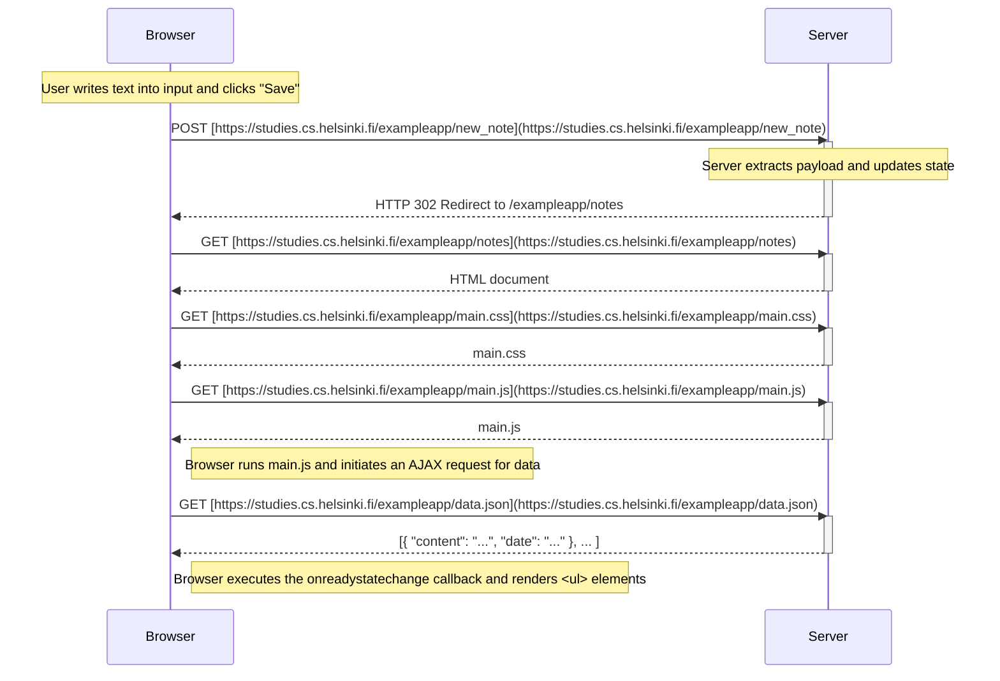
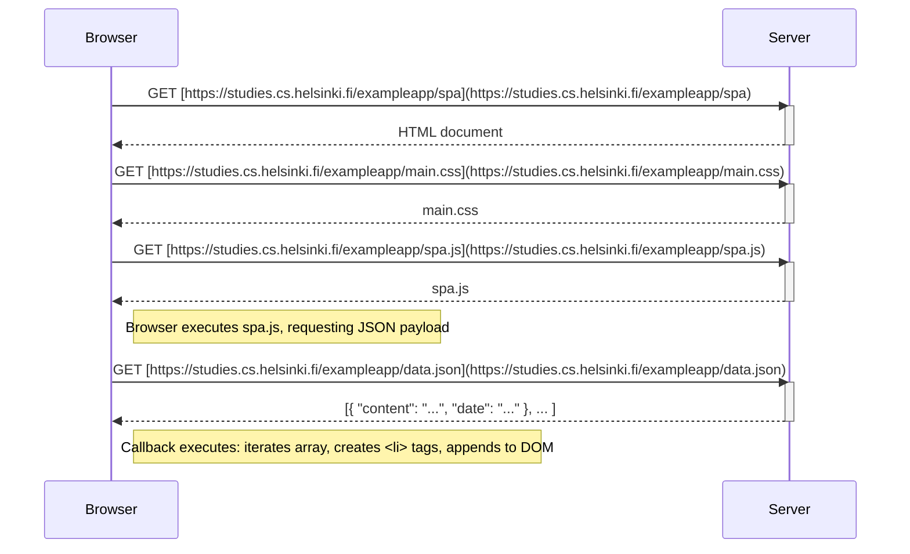
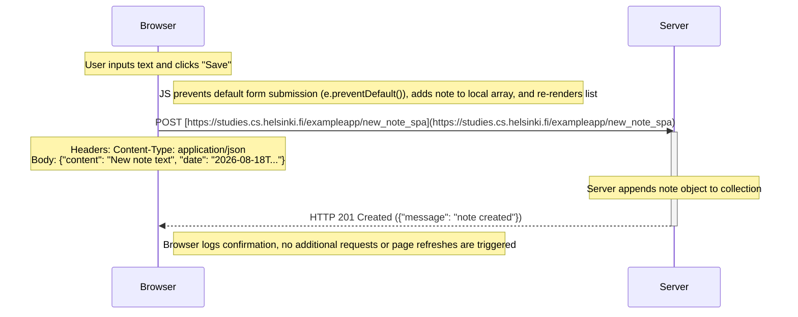

# Part 0: Fundamentals of Web Apps & Environment Setup

A standalone guide to replicating the development environment, inspecting the example apps, and documenting the sequence diagrams for Part 0.

---

## 1. Environment Setup

### 1.1 Installing `nvm` (Node Version Manager)

Full Stack Open recommends managing Node.js versions using `nvm`. In your WSL (Debian/Ubuntu) terminal:

```bash
# 1. Install curl if not present
sudo apt update && sudo apt install -y curl

# 2. Download and run the official nvm install script
curl -o- [https://raw.githubusercontent.com/nvm-sh/nvm/v0.40.1/install.sh](https://raw.githubusercontent.com/nvm-sh/nvm/v0.40.1/install.sh) | bash

# 3. Reload shell configuration
source ~/.bashrc

# 4. Verify nvm installation
command -v nvm
```

### 1.2 Installing Node.js LTS & Version Locking

Install Node.js version 22 (LTS) and pin it for the project:

```bash
# 1. Install Node 22 LTS
nvm install 22
nvm use 22

# 2. Set Node 22 as the system default
nvm alias default 22

# 3. Pin Node version for this repository via .nvmrc
echo "22" > .nvmrc

# 4. Verify active runtime versions
node -v   # v22.x.x
npm -v    # 10.x.x
```

### 1.3 VS Code Extensions (WSL Environment)

Ensure the following extensions are installed in your **WSL: Ubuntu/Debian** target:

- **REST Client** (`humao.rest-client`) - For executing HTTP requests directly inside editor files.
- **ESLint** (`dbaeumer.vscode-eslint`) - For identifying, reporting, and automatically fixing JavaScript and TypeScript code style and syntax errors.
- **Prettier** (`esbenp.prettier-vscode`) - For automated, opinionated code formatting across JavaScript, TypeScript, HTML, CSS, JSON, and more.

---

## 2. Analysis Methodology (Browser DevTools)

To trace requests and document the communication flows:

1. Open Google Chrome / Chromium DevTools (`F12` or `Ctrl + Shift + I`).
2. Navigate to the **Network** tab.
3. Check **Disable cache** and select **Preserve log**.
4. Filter by **Doc**, **JS**, **CSS**, and **Fetch/XHR** to isolate specific assets and AJAX requests.

---

## 3. Exercise Solutions & Sequence Diagrams

### 0.4: New Note Diagram (Traditional Multi-Page App)

Target URL: `https://studies.cs.helsinki.fi/exampleapp/notes`

- **Mechanism:** Submitting the HTML form triggers a classic `POST` request with form data (`note=...`).
- **Server Action:** Appends the note to the in-memory array and responds with an HTTP `302 Found` redirect back to `/notes`.
- **Client Action:** The browser follows the redirect, reloading the entire page, downloading the HTML, CSS, JavaScript bundle, and fetching the raw notes JSON again.



---

### 0.5: Single Page App Diagram

Target URL: `https://studies.cs.helsinki.fi/exampleapp/spa`

- **Mechanism:** The browser loads a minimal HTML shell and fetches `spa.js`.
- **Client Action:** `spa.js` executes immediately, requests the raw data (`data.json`), and handles DOM creation programmatically in the browser without server-side templating.



---

### 0.6: New Note in Single Page App Diagram

Target URL: `https://studies.cs.helsinki.fi/exampleapp/spa`

- **Mechanism:** The form submission is intercepted by an `onsubmit` JavaScript event handler using `e.preventDefault()`.
- **Client Action:** The client immediately creates a new note object, pushes it to its local in-memory array, and re-renders the DOM list locally (optimistic UI update).
- **Server Action:** The client sends a `POST` request with JSON payload (`Content-Type: application/json`). The server responds with `201 Created`; no page reload or redirect takes place.


